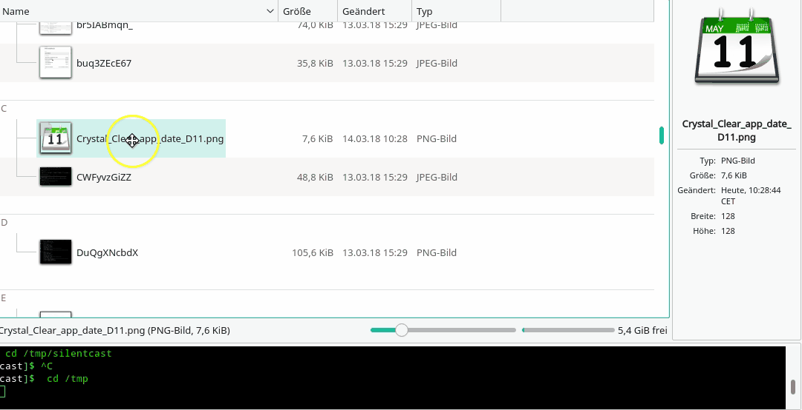

# Installation

## KDE Plasma 6

1. Copy the .sh file, and the .desktop file to:

    `/usr/share/kio/servicemenus/`

2. Make the script executable:

    `sudo chmod +x /usr/share/kio/servicemenus/change-file-date.sh`

3. Run `kbuildsycoca6` on CLI, or restart your Plasma session.

# How to use

